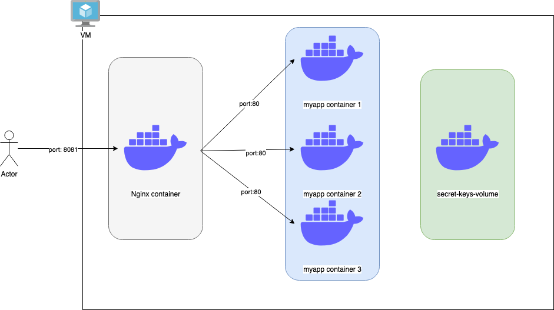

# ta-ansible
This project aims to create an API hello world exposed by nginx server.

The API responds on requests using port 8081 and returns a json :

```json
{ "message":"Hello World" }
```

<p align="center">
  
</p>

# Usage
## Configuration
The destination of the project deployment of this project is controlled by **inventory.ini** file.

The file must be updated to reflect the IPs of each environment.
```
[dev]
host1 ansible_ssh_host=dev-host-ip # Update dev-host-ip by the dev VM IP

[staging]
host2 ansible_ssh_host=staging-host-ip # Update staging-host-ip by the staging VM IP
```

## Deployment
In order to deploy the project, the following command must be executed : 

```bash
ansible-playbook -i inventory.ini deploy.yml -e "env=<ENVIRONMENT_NAME>" -v -u <ANSIBLE_USER>
```

